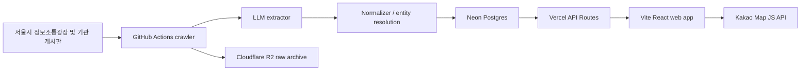

# 공무원맵

[](https://react.dev/)
[](https://www.typescriptlang.org/)
[](https://vite.dev/)
[](https://vercel.com/)
[](LICENSE)

전국 지자체가 법령에 따라 공개하는 업무추진비 집행내역을 수집하고 정제해, 공무원이 자주 방문한 식당을 지도에서 확인하는 시민 서비스입니다.

서비스: [공무원맵.com](https://xn--ob0bo0wl1ax52a.com/)

## 핵심 아이디어

광고나 리뷰가 아니라, 공공기관의 공식 공개 기록에서 반복적으로 등장하는 식당을 통계 신호로 보여줍니다.

- 최근 12개월 방문 기록을 기준으로 식당별 점수를 계산합니다.
- 방문 수와 부서 다양성을 함께 반영합니다.
- 지도, 목록, 상세 패널에서 원문 출처와 집행 정보를 함께 확인할 수 있습니다.
- 사용자 댓글, 별점, 자유 텍스트 후기는 v1 범위에서 제공하지 않습니다.

## 주요 기능

- Kakao Map 기반 식당 지도
- 서울시청, 서울시의회, 25개 자치구청, 25개 자치구의회 데이터
- 자치구 검색, 정렬, 폐업 포함 필터
- 공무원픽 단일 필터: 강추, 추천, 신규 등급을 한 번에 표시
- 식당별 방문 기록, 방문 부서, 평균 금액, 원문 링크
- 정보 수정, 삭제 요청, 폐업 신고 플로우
- 공개 REST API와 `/llms.txt` 기반 AI 에이전트 접근

## 아키텍처



## 기술 스택

| 영역 | 선택 |
| --- | --- |
| Web | Vite, React, TypeScript, Mantine |
| Map | Kakao Map JS API |
| API | Vercel API Routes |
| Database | Neon Postgres |
| Storage | Cloudflare R2 |
| Pipeline | Python, GitHub Actions, multi-LLM extraction |
| Deploy | Vercel |

자세한 결정 배경은 [docs/TECH_STACK.md](docs/TECH_STACK.md)와 [docs/adr](docs/adr)를 참고하세요.

## 로컬 실행

```bash
npm install
npm run dev
```

웹앱은 기본적으로 Vite 개발 서버에서 실행됩니다.

```bash
npm run build
npm run test:web
npm run test:api
npm run check:public-contracts
```

## 환경 변수

루트의 [.env.example](.env.example)을 복사해 필요한 값을 채웁니다.

```bash
cp .env.example .env
```

주요 변수:

| 변수 | 용도 |
| --- | --- |
| `VITE_KAKAO_JS_KEY` | 브라우저용 Kakao Map JS 키 |
| `VITE_TURNSTILE_SITE_KEY` | 신고/요청 폼 Turnstile site key |
| `DATABASE_URL` | 쓰기 작업용 Neon 연결 문자열 |
| `DATABASE_URL_READONLY` | 공개 API 읽기 전용 Neon 연결 문자열 |
| `KAKAO_REST_KEY` | 서버 측 장소 정합성 확인 |
| `R2_*` | 원문 파일 아카이브용 Cloudflare R2 |
| `TURNSTILE_SECRET_KEY` | 서버 측 Turnstile 검증 |

운영 환경 변수와 배포 절차는 [docs/RUNBOOK.md](docs/RUNBOOK.md)를 따릅니다.

## 저장소 구조

```text
.
├── api/                 # Vercel API Routes
├── apps/web/            # React 웹앱
├── docs/                # PRD, ADR, 운영 문서
├── scripts/             # 검증 및 리포트 스크립트
├── services/pipeline/   # 수집, 추출, 정규화, 적재 파이프라인
└── supabase/            # SQL migration 및 DB 보조 자산
```

## 데이터와 법적 경계

- 데이터 출처는 공공누리 제1유형 공개 자료를 우선합니다.
- 출처 표기는 푸터, OpenAPI, `/llms.txt`에서 유지합니다.
- 공무원 개인 실명 노출 정책은 [docs/LEGAL_PRIVACY.md](docs/LEGAL_PRIVACY.md)가 최종 기준입니다.
- 식당 등급은 통계 신호이며 맛, 품질, 비위 여부를 단정하지 않습니다.
- 사용자 댓글, 평점, 후기는 v1에서 금지합니다.

## AI 에이전트 작업 규칙

이 저장소에서 Codex, Claude Code, Cursor 등 AI 에이전트가 작업할 때는 [AGENTS.md](AGENTS.md)를 먼저 읽어야 합니다.

작업 영역별 필수 문서:

- 제품 요구사항: [docs/PRD.md](docs/PRD.md)
- 시스템 구조: [docs/ARCHITECTURE.md](docs/ARCHITECTURE.md)
- 데이터 모델: [docs/DATA_MODEL.md](docs/DATA_MODEL.md)
- 파이프라인: [docs/PIPELINE.md](docs/PIPELINE.md)
- UI/UX: [docs/UI_UX.md](docs/UI_UX.md)
- 검증: [docs/TEST_PLAN.md](docs/TEST_PLAN.md)

## 라이선스

소스 코드는 [PolyForm Shield License 1.0.0](LICENSE)로 배포합니다. 비상업적 이용, 내부 사용, 연구 목적으로 자유롭게 사용 가능하며, 경쟁 제품을 제공하는 상업적 이용은 금지됩니다.

공공기관 원문 자료, 수집 데이터, 지도 타일, 제3자 API 응답은 각 제공자의 이용 조건과 공공누리 출처 표기 정책을 따르며 본 라이선스 대상이 아닙니다.
